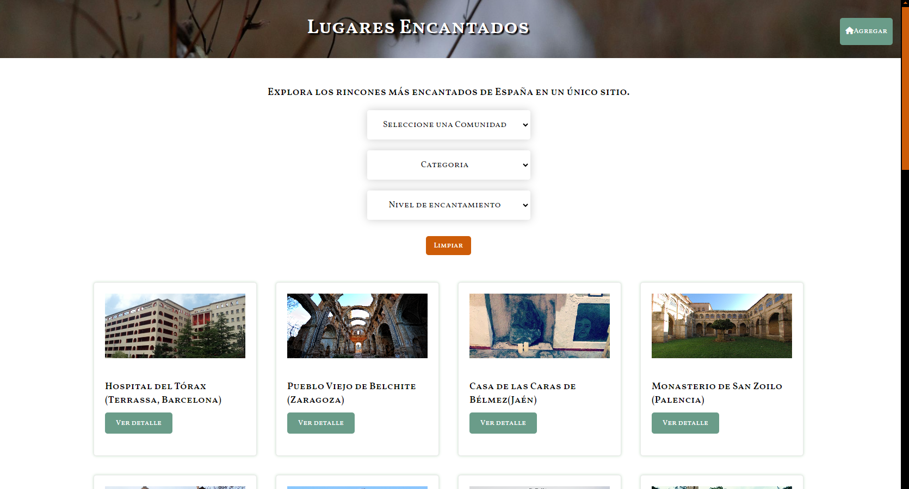

# Lugares Encantados: ¡Misterios y Encantamientos!

¡Bienvenido a este *buscador de Lugares Encantados*!

Este proyecto web te invita a adentrarte en el fascinante mundo de los lugares encantados de España, ¡todo en un solo lugar! Donde podrás explorar rincones misteriosos y llenos de encanto, categorizados por comunidad autónoma, tipo de lugar y nivel de misterio. Pero eso no es todo, ¡también tienes la oportunidad de contribuir a esta comunidad de exploradores añadiendo nuevos lugares, editando la información existente y participando en la aventura de descubrir lo desconocido!

## Características Principales:

- **Explora el Misterio:** Sumérgete en el fascinante mundo de España explorando lugares encantados clasificados por ubicación, tipo y nivel de misterio.
- **Añade tu Descubrimiento:** ¿Has encontrado un nuevo lugar encantado? ¡Comparte tu hallazgo con la comunidad! Agrega detalles como nombre, imagen, descripción y más para que otros también puedan disfrutarlo.
- **Edita y Mejora:** ¿Necesitas corregir o actualizar la información de un lugar? No hay problema. Puedes editar los detalles existentes para mantener la base de datos actualizada y precisa.
- **Eliminación Segura:** Implementé un proceso de eliminación que te solicita confirmación antes de borrar cualquier lugar, garantizando que tus datos estén seguros.

## Estructura del Proyecto:

- **HTML:** La estructura de la página web está envuelta en misterio, con secciones y formularios que guiarán la búsqueda.
- **Estilos:** Los estilos CSS, diseñados con `Sass`, están creados para ofrecer una experiencia inmersiva y llena de encanto.
- **JavaScript:** Se utilizó JavaScript para dar vida a la página, desde la obtención y agregación de datos hasta el filtrado y la eliminación.
- **Interacción con API REST:** Desarrollé una API REST con soporte para métodos GET, POST, PUT y DELETE para gestionar datos de lugares encantados de manera eficiente y segura. Utilicé `MockAPI` para simular el entorno de producción, garantizando un manejo confiable de la información.
- **FontAwesome:** Los iconos de FontAwesome se utilizaron para añadir un toque especial al misterio de la página.

## Contenido del Repositorio:

- `index.html`: El corazón de mi proyecto, donde reside el misterio del HTML.
- `styles.css`: El archivo CSS que da vida a mi página web con un estilo misterioso.
- `get.js`, `put.js`, `post.js`, `delete.js`, `filtros.js`: Archivos JavaScript que contienen conjuros para obtener, editar, agregar, eliminar y filtrar  los lugares Encantados.
- `assets/`: Un tesoro de imágenes y recursos utilizados para enriquecer mi experiencia web.

## Autora:

- **Gisella Ortiz de la Tabla** 

¡Únete a mí en esta emocionante aventura de descubrimiento y misterio en "Lugares Encantados"!¡Adéntrate en los lugares misteriosos haciendo [clic aquí ](https://giseot.github.io/Buscador-Lugares-Encantados/)! 🌟👻✨

